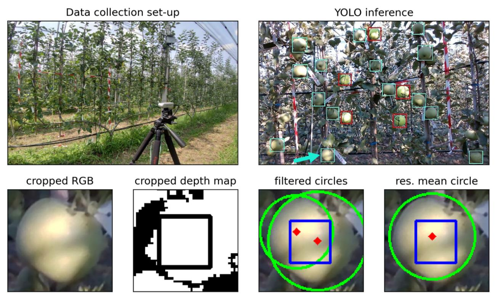

# OpenAcces_RGBD_apple_dataset
Bortolotti Gianmarco , 
Piani Mirko , 
Gullino Michele , 
Franceschini Cristiano , 
Mengoli Dario , 
Manfrini Luigi 

# The dataset
This dataset contains RGB (`.png`) and Depth (`.npy`) images togheter with image annotations (`.json`) in [supervisely format](https://docs.supervisely.com/customization-and-integration/00_ann_format_navi)

**For what purpose was the dataset created?**\
***Open_Access_RGBD_apple_dataset*** was developed specifically for the purpose of facilitating the development, testing and evaluation of the performances of fruit sizing algorithms exploiting RGB-D images. The dataset encompasses a wide range of lighting conditions, following most of the growth season of 25 Fuji apples (cv. Atec): from ~40 mm to ~100 mm diameter. Consequently, this dataset presents an opportunity to develop RGB-D based sizing algorithms and evaluate their performances with the availability of caliper measured reference ground truth data.

**What do the instances that comprise the dataset represent?**\
The dataset comprises labeled RGB-D images capturing the 2022 growth season of Fuji apples (`apples`) in Cadriano (Bologna, Italy), taken at the University of Bologna's experimental farm. These images depict two different trees from various perspectives (e.g., high, low, full tree) and object-camera distances (e.g., 1.0m, 1.5m) using an [Intel RealSense D435i](https://www.intelrealsense.com/depth-camera-d435i/) camera.\
The dataset also features **tennis balls** (`TB`) within images to aid performance evaluation. Tennis balls are iso-diametric, unlike apples, allowing for normalization of evaluation and better assessment of sizing performance by comparing detected diameters to their physical representation. Using only apple features implies that the computer vision system could detect a different diameter from the reference one, resulting in an increase of the sizing error.

**Is there a label or target associated with each instance?**
Manual labeling, undergone with [Supervisely](https://supervisely.com/), and association with the reference growth data of 25 fruits and tennis balls was done to allow ground truth data:
* *data_ground_truth/*`evaluation_ground_truth.csv`: Contains cleaned reference data on fruit size, adhering to fruit growth assumptions such as continuous growth or steady-state conditions. This dataset serves as a reference for evaluating the performance of sizing algorithms.
* *data_ground_truth/*`applicative_ground_truth.csv`: ncludes raw reference data collected in the field from two reference trees, supplemented by data from other trees to enhance the statistical representativeness of field variability at each sampling date. This dataset accounts for human errors (e.g., selecting a different fruit reference diameter) and digital caliper errors, serving statistical purposes.
  
In addition to manual annotations, image labels also include fruit detection bbox coordinates obtained through both a pre-trained YOLOv5l-det model from [ultralytics](https://www.ultralytics.com/) and a trained on a custom dataset YOLOv5l model. The detections are distinguished from manual annotation within the image labels as showed in the [*data_exploration notebook*](notebook/data_exploration.ipynb).

**What mechanisms or procedures were used to collect the data?**
The data was collected using a D435i Intel Realsense camera, which was mounted on a tripod. The data was recorded by streaming the camera's feed into bag format with [intel® RealSense™ Viewer](https://www.intelrealsense.com/sdk-2/) and then extracting the frames for each date. Specifically, the camera was connected via a USB 3.0 interface to a PC running Ubuntu 18.04.

image from  [Bortolotti et. al. 2023](https://www.wageningenacademic.com/doi/10.3920/978-90-8686-947-3_67)

### utilities
* [convert](./docs/format_conversion.md) the dataset structure into either Supervisely or YOLO format
* [research papers](./docs/research_papers.md) using this dataset.
___

To **cite this dataset**, refere to it as:
> Bortolotti, G., Piani, M., Gullino, M., Franceschini, C., Mengoli, D., & Manfrini, L. (2024). OpenAcces_RGBD_apple_dataset [Data set]. https://doi.org/10.5281/zenodo.10687503
